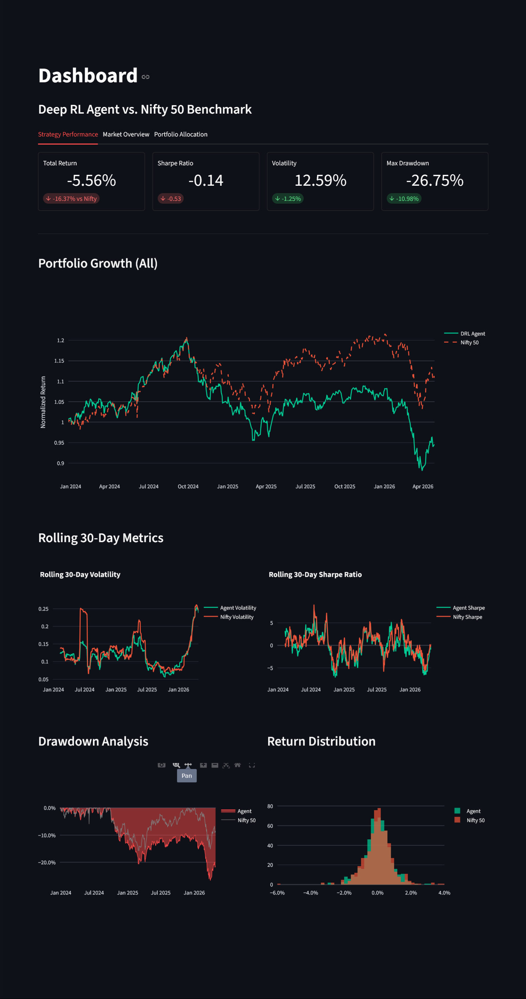
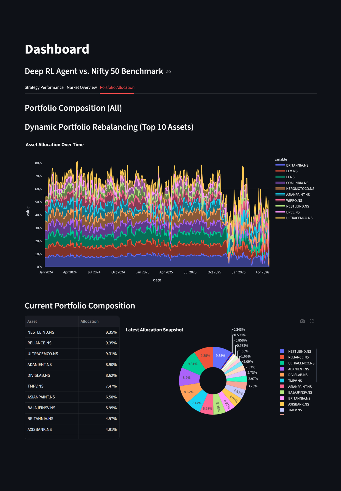

# Deep Reinforcement Learning Portfolio Optimizer 📈


An end-to-end, production-grade automated asset allocation and portfolio management system. This project implements a **Proximal Policy Optimization (PPO)** Deep Reinforcement Learning agent to dynamically rebalance equity allocations across the Nifty 50, optimizing for maximum risk-adjusted returns over a multi-year horizon.

The entire ecosystem—from data ingestion and rolling-window feature engineering to model training and interactive visualization—is engineered using professional MLOps best practices, including multi-stage containerization, decoupled services, and strict chronological data validation.

---

## Dashboard & Backtest Results

*(The agent was trained on 2014–2024 market data and evaluated on an unseen out-of-sample window from 2025–2026. Notice how the agent dynamically allocates to CASH during market drawdowns to preserve capital.)*


*Figure 1: Out-of-sample Cumulative Returns comparing the DRL Agent against the Nifty 50 Benchmark.*


*Figure 2: The Agent's dynamic portfolio weight distribution across major assets and Cash reserves over time.*

---

## System Architecture

The pipeline is split into three decoupled services, entirely coordinated via Docker Compose:

1. **Data Engineering Ingestion Pipeline:** Fetches 12 years of historical market data via the Yahoo Finance API. Handles complex `NaN` dropouts across 50+ simultaneous assets using forward/backward filling, and engineers 255+ rolling technical features (RSI, SMA, Bollinger Bands).
2. **Deep RL Training Engine (`Stable-Baselines3`):** Instantiates a custom OpenAI `Gymnasium` environment (`PortfolioEnv`) and executes the PPO training loop over the historical data block.
3. **Interactive Analytics Dashboard (`Streamlit`):** A web-based UI that reads saved model states, executes the evaluation backtest, and generates interactive comparative visualizations.

---

## Production Engineering & MLOps Highlights

Rather than deploying a standard monolithic script, this project was systematically refactored to align with enterprise production standards:

* **Robust Data Engineering:** Solved historical dimension collapse by implementing chronological Train/Test splitting and robust NaN-handling, ensuring the model trains on 3,000+ continuous trading days without look-ahead bias.
* **Optimized Multi-Stage Docker Builds:** Separated the heavy build-toolchain dependencies from the production runtime. This reduced the final deployment image footprint significantly.
* **Least-Privilege Security Boundary:** Avoided the Docker container security anti-pattern of executing as root. The container establishes a dedicated, unprivileged user (`appuser` with strict GID/UID 1000 permissions) to run the application runtime securely.
* **Volume Mount State Management:** Decoupled the codebase from the container runtime. The model weights, scaled datasets, and evaluation metrics are saved dynamically to the host machine via volume mounts, preventing data loss when containers spin down.

---

## Quickstart (Local Deployment)

Because the entire infrastructure is fully containerized, you do not need Python, PyTorch, or any local libraries installed on your host machine. You only need **Docker Desktop**.

### 1. Clone the Repository

```bash
git clone https://github.com/RishiBarapatre/DRL_portfolio_management.git
cd DRL_portfolio_management
```

### 2. Build the Docker Environment

Compile the environment blueprint (installs PyTorch, Pandas, Streamlit, etc.):

```bash
docker compose build
```

### 3. Run the End-to-End Pipeline

Execute these commands sequentially to generate data, train the agent, evaluate it, and view the dashboard.

> **Note:** The `-v` flag binds your local directory to the container so you can see the saved files instantly.

**Step A — Download Data & Engineer Features**

```bash
docker compose run --rm -v "${PWD}:/usr/src/app" trainer python data_utils.py
```

**Step B — Train the Deep RL Agent**

```bash
docker compose run --rm -v "${PWD}:/usr/src/app" trainer
```

**Step C — Evaluate the Backtest on Unseen Data**

```bash
docker compose run --rm -v "${PWD}:/usr/src/app" trainer python evaluate.py
```

**Step D — Launch the Analytics Dashboard**

```bash
docker compose up -d dashboard
```

### 4. View Results

Open your web browser and navigate to:

```
http://localhost:8501
```

When you are finished viewing the dashboard, spin down the background container to free up memory:

```bash
docker compose down
```

---

## Future Enhancements

- Incorporate Short-Selling constraints.
- Integrate VIX (Volatility Index) features for advanced crash-detection.
- Implement custom CNN/LSTM policy extractors in PyTorch.